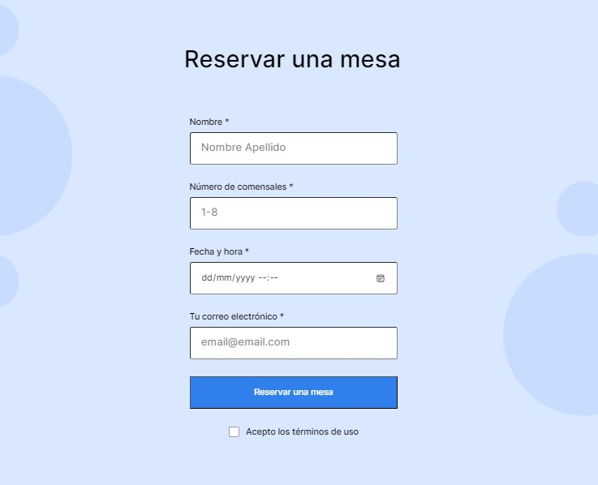

# Triple Espresso

# Bienvenida a la cafetería y descripción de métodos de preparación de café. Ademas esta la posibilidad de hacer pedidos y ponerse en contacto via redes sociales.

# HTML y CSS

# Diseño de página en base a la metodología BEM

# Utlización de herramienta flexbox para orden de la página.

# Contenido embebido desde sitio externo.

# Desarrollo de formulario para toma de pedido.

